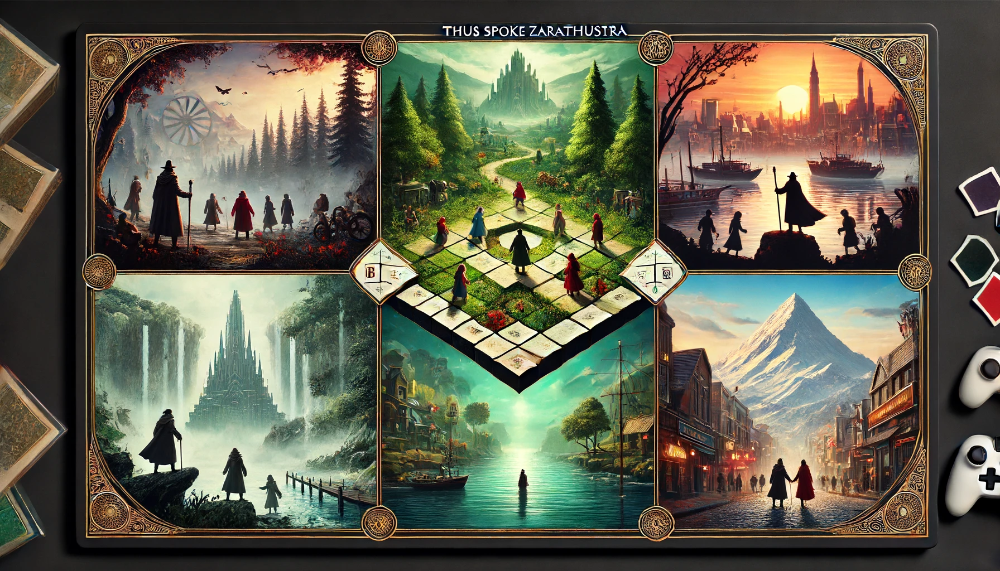

# AIMUD，一个由 AI 驱动的互动小说游戏引擎


### 游戏介绍

这是 AIMUD，一个由 AI 驱动的互动小说游戏引擎。本游戏突破了传统文字游戏基于预先定义的规则的范式，打破了游戏设计者与游戏玩家身份的对立，力求创造一种新的游戏类型：AI 驱动的开放式文字幻想游戏。

此项目结合自然语言处理技术，基于最近的流行的 RAG（检索增强） 方法创造了一种全新的游戏/游戏创作体验。

AIMUD 不是一个具体的游戏，而是一个游戏引擎。这个项目的目标是提供一个易于使用的框架，实现零代码、零学习成本创作文字游戏。这些特性使得游戏能够快速迭代，任何零星的创意都能够得到落地。

##### AIMUD 创作的游戏如何进行

简单是 AIMUD 的核心。游戏机制可以用一句话概括：玩家给出角色的下一步行动，而由 AI 语言模型管理游戏世界的动态。

具体的游戏流程如下：

玩家行动（任意文字指令） -> 关键词提取 -> 故事续写（LLM） -> 关键词更新（LLM）-> 玩家行动...

##### 面向用户群体

本游戏引擎制作的游戏具备无尽可能，可以用于各种娱乐和教育目的，如语言学习、人文历史学习、虚拟旅游、跑团交友、悬疑小说创作等。因此没有特定的目标群体。另外，虽然游戏现在是以纯文本的方式进行交互，但也很容易引入语音功能，这将进一步降低游戏门槛，使得对非传统游戏玩家群体也有一定的吸引力。

### 游戏技术创新

##### AI 作为游戏引擎

本游戏通过大语言模型驱动，没有传统游戏中常见的物理引擎，因此相对于传统游戏，在空间、时间上的流动的自由度更大，因此更易于展示一些抽象的概念。当然提供灵活性的同时，也对游戏呈现内容的准确程度造成了挑战，而这种挑战和基座大语言模型、RAG 技术等的发展息息相关。现有大模型的幻觉（Halluciation）现象是瓶颈之一。

##### LLM 驱动的关键词检索

不同的关键词由引用关系相互链接，因此游戏的关键词库会形成一个图。该游戏引擎创作的每一个具体的游戏实例都需要指定"word_search_depth"这个参数，它决定了当续写出的文本的包含关键词时，会唤起几层的关键词资料提供给模型参考。例如当 word_search_depth = 1 时，会从每次续写出的文本中提取所有关键词，然后提供给模型相应的词条。而当 word_search_depth = 2 时，还会将这些提取出的“直接”关键词所能链接到的所有“间接”关键词提取给模型。

##### 动态模型调用、窗口调控

游戏的进程包括关键词提取和故事续写两个部分，关键词提取使用较小模型（Claude-3-Sonnet），基于较短的窗口。故事续写则使用较大模型（GPT-4-Turbo），基于较长的窗口。一个可行的有待探索的方案是使用基于各自特定目的微调的大模型。

### 游戏理念创新

##### 数据即代码，游戏是游戏制作的一部分

AIMUD 游戏与传统游戏的主要区别之一是，游戏进度等同于游戏实例本身。这句话有两方面的含义：第一，游戏设计师创作游戏的过程不再是静止的，而是可以充当游戏世界上帝的角色，通过上帝的“游玩”完成游戏的设计。第二，游戏玩家进行角色扮演的过程也是创作游戏的过程，他每一刻的游玩进度都可以当做一个不同的游戏分享给他人。因此从某种意义上说，每个玩家都成为了游戏设计师。

##### 无需明确的正反馈系统

AI 游戏最主要的趣味在于它能辅助玩家进行对于理想世界冒险的幻想，在这样的背景下，一些传统游戏中必不可少的正反馈环节就显得多余了。我们希望游戏给玩家一个灵活多变、扩展度强的 AI 游戏框架，因此并不对玩家的游玩方式在细节上加以框定，因此并没有设定如行动顺序、胜负判定、分数计算等传统游戏中往往是必要的部分。然而，这也会带来一些新的挑战，例如，现有的大语言模型过度信任玩家，使得玩家总能够投机取巧，“越狱”破解游戏，例如在战争类游戏中创造出不符合游戏进度的神兵利器等。本质上说，这些“漏洞”的存在源于当前的语言模型相对于人类还是一个处于弱势地位的智能体，这往往在成人玩家游玩时表现得尤为明显。

### 多人游戏的实现

游戏有一个中央服务器，各个客户端通过 TCP 协议链接服务器实现多人联机。游戏有一个简单的用户管理系统，进入游戏时玩家可以选择注册/登录账号，账号名称会被作为游戏角色名用于游戏中的指称。新玩家进入游戏时，其它玩家会收到通知。虽然我们并没有设定玩家的行动顺序，但是当某个玩家的操作被执行时，其它玩家只能等待其操作完成后才能执行自己的操作。这种单线程并不是游戏必须的特性，在后续的开发中我们会考虑移除这个限制，转而用（对于游玩体验而言）更加自然的方式来处理这个问题。

### 游戏设计范例

任何游戏内容都被完全包括在一个 game.txt 之中。设计任何游戏只需填写 “overall_context, keywords, progress, text_window_size, word_search_depth, model” 等部分。看似简单，但我们接下来通过几个实例来表明，这样的结构可以千变万化，产出完全不同类型的游戏。

#### 游戏示例：查拉图斯特拉如是说



这是一个以尼采的哲学名著《查拉图斯特拉如是说》为基础创作的角色扮演冒险游戏。玩家们需要协助查拉图斯特拉进行游说和辩论。游戏的终极目标是击败上帝的追随者们，以及额外 BOSS 瓦格纳、叔本华等。游戏强调思想争锋，玩家必须学习并运用尼采哲学才能击败敌人。大语言模型本身只具备极其粗浅的尼采哲学的知识，因此我们需要在关键词中灌注尼采哲学中的概念和理论，这样当讨论特定话题时，相应的关键词就会被唤起，从而发挥大语言模型“情境学习”的技能，给出旁征博引的回复。

```json
{
    "overall_context": "这是文字游戏-查拉图斯特如是说，游戏语言是中文。游戏目标是协助查拉图斯特拉击败上帝的追随者们，以及额外BOSS瓦格纳、叔本华等。玩家的生命值需要实时显示（最大值100%）。",
    "keywords": {
		"欲望": "欲望是趋乐避苦的，但权利意志不是。",
		"贞洁": "消极的贞洁：我应当. 积极的贞洁：我爱、我要. 狭义的贞洁：性节制、性忠诚. 广义的贞洁：远离人群、爱森林.",
		"服从": "服从不一定不是权力意志，有时是看到了共同体。",
		"命令": "既不命令别人又不愿意被命令的人的奇怪的。现代民主制度不让人们看清这一事实。",
		"identity": "现代社会使人的identity失去了。",
		"战争": "重估一切价值是一场大战。战争是要讲等级的。",
		"道德": "好的道德是要帮助人们实现超越的。不是基于欲望原则的患得患失，是表里如一，要喜就是狂喜，要怒就是大怒。真正有德行的人是无私的。现代社会的道德是奴隶道德的变种。查对出世的道德是批判的。",
		"我爱": "我爱，其心灵甚奢费的人，不欲人谢，不为报答。因其时时赠予，不欲自有遗留。",
		"太阳": "生命力丰盈的人就像太阳",
		"哲人": "哲人与智者是对立的。哲人是爱智慧者，而智者是认为自己有智慧的人，教人如何与大众说话。",
		"智者": "游戏内的智者、老者敌人包括：树林中隐居的采药智者，树林中的施舍老者，进行讲座的睡眠老者。",
		"睡眠老者": "敌人。其理论包括：睡眠是目标，醒着是为了睡眠，宣扬无梦的睡眠。招数有道德睡眠术：十番克制、十番妥协。理想的末人形象。状态：未出现。",
		"基督教": "基督教的重要符号是十字架。十字架是刑具，提醒人是有原罪的。",
		"和平": "基督教：战斗是为了和平。查拉图斯特拉反对。",
		"敌人": "敌人包括各类老者、智者，以及上帝的追随者。",
		"无梦的睡眠": "引人慢性中毒的死亡。",
		"出世的道德": "支持者如来生论者，鬼魂论者，病人和垂死者。",
		"来生论者": "认为现实世界有太多的痛苦，要寻找人的彼岸。其同盟包括永生论者，厌世者，看破红尘者，多愁善感者，禁欲者，虚无主义者。状态：未出现。",
		"大人物": "又称演戏者。投机多变。做堂堂的丑角去吸引更多人。",
		"可怜": "微小者和可怜者形成声势后，便会把高尚的东西挤到角落里去。",
		"多余": "地上充斥的是多余的人，生命便因者班过多者而毁败。苟延残喘地存活着。",
		"邻人": "爱邻人是因为不自爱，不能忍受自己。每个人若不能否定和贬低自己，便无法信仰上帝。",
		"爱国": "现代民族国家是在旧的上帝偶像倒塌后树立起来的新偶像。国家是为过多者而设。现代国家的意识形态：相对主义、自由主义、个人主义、物质主义。国家的同盟者包括宗教、军队、市场、观念界（知识界）。尼采与马克思的汇合：国家要消亡。但是路径不同。尼采认为要靠少部分的超越者。",
		"偶像": "尼采认为基督教中耶稣、圣母等和祖先崇拜一样都是偶像。"
    },
    "progress": "作为追随者的玩家们，和查拉图斯特拉一道出发了。",
    "text_window_size": 1000,
    "word_search_depth": 2,
    "model": "gpt-4-turbo"
}

```

#### 游戏示例：以刺客信条为背景的双语学习游戏

```json
{
    "overall_context": "这是一个双语学习游戏，游戏语言是中文和英文。游戏目标是通过互动故事帮助玩家学习两种语言。玩家将扮演一名刺客，在一个虚构的历史城市中执行任务。",
    "keywords": {
        "刺客": "玩家扮演的角色，一个训练有素的刺客，擅长隐匿和暗杀。",
        "城市": "一个充满历史和文化的虚构城市，玩家将在这里执行任务。",
        "任务": "玩家需要完成的目标，包括找到和刺杀指定人物。",
        "线索": "通过与NPC互动，玩家可以获取关于目标的信息和线索。",
        "逃脱": "完成刺杀任务后，玩家需要迅速逃离，避免被守卫抓住。",
        "抵达": "描述玩家作为刺客刚刚抵达城市，准备开始执行任务的情景。介绍任务目标。",
        "探索": "描述玩家在城市中探索，寻找目标踪迹的过程。介绍如何通过与居民互动获取信息。",
        "问路": "解释如何用英文询问方向，例如：Excuse me, how do I get to the market? 中文解释：请问，市场怎么走？",
        "寻求帮助": "解释如何用英文寻求帮助，例如：I need some help. 中文解释：我需要一些帮助。",
        "描述目标": "解释如何用英文描述目标，例如：Have you seen this person? He is wearing a black cloak. 中文解释：你见过这个人吗？他穿着黑色的斗篷。",
        "请求信息": "解释如何用英文请求信息，例如：Do you know where he usually appears? 中文解释：你知道他通常在哪里出现吗？",
        "获取线索": "描述玩家通过对话获取目标线索的情景。介绍如何前往市场寻找更多线索。",
        "执行任务": "描述玩家找到目标并制定计划完成刺杀的过程。",
        "逃离现场": "描述玩家完成任务后迅速逃离现场的过程。",
        "学习内容": "解释每个场景和任务中会遇到的新的词汇和短语，通过与NPC对话和完成任务来学习和使用这些语言。",
        "对话选项": "解释玩家在每次对话中可以选择使用中文或英文进行交流，系统会根据玩家的选择提供相应的反馈和提示。",
        "学习进度": "解释玩家可以在游戏过程中查看自己的语言学习进度，包括已学会的词汇和短语，以及完成的任务数量。"
    },
    "progress": "玩家作为一名刺客，刚刚抵达城市，准备开始执行任务。",
    "text_window_size": 800,
    "word_search_depth": 1,
    "model": "gpt-4-turbo"
}

```

#### 游戏示例：私人笔记管家

本游戏的灵感来自双链笔记软件 Obsidian。 这个游戏像不像一个智能版的 Obsidian 呢？

```json
{
    "overall_context": "这是文字游戏-私人笔记管家，游戏语言是中文。笔记管家 Chole 一个活泼可爱的女孩，其任务是帮助玩家将想法整理成条目清晰的笔记，以及反馈通过关键词所查询到的玩家过往的笔记内容。",
    "keywords": {
    },
    "progress": "Chloe: 你好，请问今天有什么想法想要制作成笔记吗？或者你想要回顾关于哪些内容的笔记呢？",
    "text_window_size": 1000,
    "word_search_depth": 3,
    "model": "gpt-4-turbo"
}
```

#### 游戏示例：狼人杀

由于对话本身也是文字，我们不需要加入一个特定的“聊天系统”。这样，开发需要玩家之间大量沟通的游戏也是方便的。

```json
{
    "overall_context": "这是基于AIMUD引擎的狼人杀游戏，玩家通过分析对话和事件来确定狼人的身份。",
    "keywords": {
        "狼人": "夜间进行杀戮的角色，白天尝试隐藏自己的身份。",
        "村民": "普通角色，需要找出狼人并投票驱逐他们。",
        "预言家": "每晚可以查看一名玩家的身份，帮助村民识别狼人。",
        "女巫": "拥有一瓶解药和一瓶毒药，夜间可以选择使用。",
        "猎人": "被驱逐时可以带走一名玩家。",
        "守卫": "每晚可以保护一名玩家不被狼人杀害。",
        "讨论": "玩家在白天进行的讨论，可以交流思想和怀疑。",
        "投票": "玩家投票决定谁最有可能是狼人。",
        "背叛": "玩家之间的欺骗和误导行为，用来掩盖或指出狼人。",
        "联盟": "玩家之间可能形成的临时同盟，共同对抗狼人或其他威胁。",
        "夜间行动": "狼人和部分特殊角色在夜间的秘密行动。",
        "死亡": "玩家的游戏结束状态，可以由狼人杀害或被村民投票驱逐。"
    },
    "progress": "游戏开始，所有玩家分配角色，进入第一个夜晚。",
    "text_window_size": 1500,
    "word_search_depth": 2,
    "model": "gpt-4-turbo"
}
```

### 游戏的未来发展方向畅想

##### 图像与视频生成

全球多个顶尖 AI 实验室正在探索 AI 视频生成领域，未来可以通过生成场景图像和视频增加游戏的沉浸感。对于这个方向，游戏角色在不同视频之间的一致性是最为影响代入感的，视频本身的质量（如清晰度）反倒是其次。

##### 音乐选择与生成

一种简单的方案是，创建一个背景音乐库，借助现有的大语言模型根据游戏场景选择不同的音乐，以契合游戏进度。更进一步地，最近人工智能在音乐生成方面有了突破性的进展，可以为游戏中的不同场景生成独特的背景音乐，这更加拓展了游戏体验的可能性。

##### 智能体互动

斯坦福的一篇论文里使用多个独立的 GPT 构建出了一个虚拟小镇，每个 NPC 都是一个语言模型，且记忆互不共享。类似该小镇实验中的多个智能体的互动可以用于弥补本游戏的一些缺陷：即无隐藏信息、NPC 主动性不够，不会自动发展，完全以玩家为中心。（在单人游戏时这种感觉尤为明显）多智能体故事生成可以帮助产生暗线、悬疑和更具体的反派，而这对于营造游戏中激烈的冲突是必不可少的。

### 总结

AIMUD 引擎的发展展示了一种全新的游戏设计理念，其核心在于利用 AI 技术的进步为玩家提供一个动态且互动性极高的虚拟游戏世界。这种由 AI 驱动的互动小说游戏引擎不仅推动了游戏体验的创新，还对游戏设计师和玩家之间的界限提出了新的思考。

通过持续集成最新的 AI 技术和探索未来的发展方向，AIMUD 可以不断优化和扩展其功能，从而提供更加丰富和沉浸式的游戏体验。无论是通过图像和视频生成增加视觉沉浸感，还是通过智能音乐生成增强情感交流，或是通过多智能体系统增加游戏复杂性和深度，AIMUD 都在不断探索 AI 和游戏融合的新境界。

最终，AIMUD 不仅仅是一个游戏引擎，它是一个探索人类创造力和机器智能结合可能性的实验场，一个挑战传统游戏设计限制的平台，以及一个推动教育、娱乐和社交互动创新的前沿工具。随着技术的进步和游戏社区的参与，AIMUD 的未来充满无限可能。
